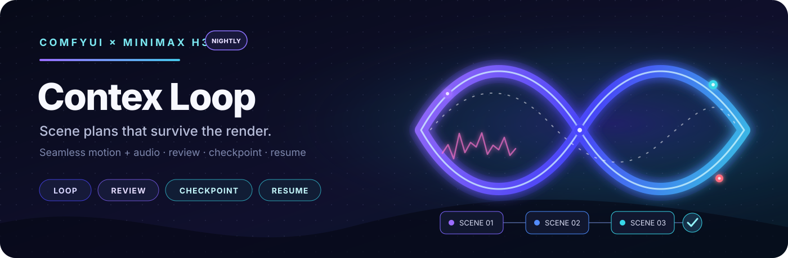

<p align="center">
  
</p>

# ComfyUI MiniMax H3 Contex Loop

Turn one MiniMax H3 sampling body into a scene-by-scene production loop. Every
accepted scene carries motion and optional audio forward, saves a checkpoint,
can be reviewed or retried, and joins into the final video without building a
huge cumulative image tensor.

[Prompt & timing guide](H3_CHAIN_FORMAT_GUIDE.md) ·
[Example workflows](example_workflows/README.md) ·
[Third-party credits](THIRD_PARTY_NOTICES.md)

> **Contex** is the intentional public repository spelling.

## Changelog

Newest first. Recent additions stay visible; older milestones are folded away
so this page remains a useful starting point rather than a changelog wall.

- **v0.3.8 — One-pass performance re-filming.** A Reference Video Prep node
  converts native VIDEO or decoded IMAGE/AUDIO to exact 24 fps Ref2VA input,
  copies its soundtrack without padding or time-stretching, and powers a new
  experimental three-angle guitar workflow.
- **v0.3.7 — Flexible video loaders.** Existing Video Context now accepts a
  native ComfyUI `VIDEO` directly or separate `IMAGE + AUDIO + FPS` outputs
  from VHS and other decoding nodes.
- **v0.3.6 — Extend an existing video.** A typed adapter turns decoded video
  and optional audio into scene 1 context, while optional prepend preserves the
  normalized original before partial or final assembled output.
- **v0.3.5 — Native guides and portable assembly.** Automatically uses
  ComfyUI’s native arbitrary-position AV guides when PR #15439 (or its merged
  equivalent) is present, retains the guarded legacy path, and falls back to
  PyAV review and stream-copy assembly when no `ffmpeg` executable is available.
- **v0.3.4 — Scene Prompt Editor.** A synchronized, large-format companion for
  editing each scene’s real Plan prompt, with scene navigation, reference and
  dialogue shortcuts, and adjustable type size.
- **v0.3.3 — Reliable preview resizing.** Review video sizing now remains stable
  when the ComfyUI canvas is zoomed.
- **v0.3.2 — Resizable review video.** Drag the bar beneath Review Gate’s player
  to give the preview more or less room.
- **v0.3.1 — Friendlier JSON defaults.** Top-level `duration_seconds` and `steps`
  shorthand now populate the visual Plan defaults correctly.
- **v0.3.0 — Archival PNG export.** Re-decode saved scene checkpoints into a
  continuous lossless PNG sequence without holding the whole production in RAM.

<details>
<summary><strong>v0.2.0 — Recovery, metadata, and compatibility</strong></summary>

- Persisted each scene prompt, effective plan, workflow, and API prompt beside
  the rendered chain.
- Added scene-range rendering, resumable review checkpoints, partial assembly,
  notification/timeout controls, and Firefox-safe Review Gate recovery.
- Added guarded compatibility with H3-Multishot, SolAttn, Ref2VA, and the
  separately installable upstream H3 Motion Context pack.
- Added Comfy Registry publishing and the shorter project-focused README.

</details>

<details>
<summary><strong>v0.1.0 — The production loop takes shape</strong></summary>

- Introduced the visual scene-plan editor, readable multiline prompts, automatic
  scene colors, responsive layout, and collapsible raw JSON.
- Added the recursive one-body chain, frame-locked audio trimming, per-scene
  checkpoints, interactive review/retry, and the looping Ref2VA example.
- Renamed the expanded project **MiniMax H3 Contex Loop** so it can coexist
  clearly with NikoDemon80’s original manual Motion Context tools.

</details>

<details>
<summary><strong>Origins — Motion Context and Ref2VA continuation</strong></summary>

- Began with MiniMax H3 clip chaining and true generated-audio continuation.
- Added motion-context support for H3 Ref2VA, followed by opt-in compatibility
  patches and a resumable disk-backed loop.

</details>

## Why this project has its own name

This work began with **NikoDemon80’s** excellent
[H3 Motion Context](https://github.com/NikoDemon80/ComfyUI-H3-Motion-Context).
As it grew from a continuation experiment into a full scene planner, recursive
renderer, review gate, checkpoint system, and recovery workflow, sharing the
same identity stopped being helpful.

**MiniMax H3 Contex Loop** gives both projects room to be clear: Niko’s pack
stays focused on manual Motion Context tools, while this one can evolve around
long, reviewable productions. Their node IDs are separate, both can be installed
together, and existing `output/h3_chains/` checkpoints remain valid. It is a
new lane, not an erased history—the original research and commit lineage stay
credited.

The Ref2VA multi-reference/audio fix and first global-ref demo were contributed
by **seitanism**. The editor’s quick reference/dialogue interactions were
inspired by **nkxx188’s**
[ComfyUI-MiniMaxH3-Easy](https://github.com/nkxx188/ComfyUI-MiniMaxH3-Easy).

## What you get

| | Feature |
|---|---|
| 🎬 | Visual multiline scene planner with exact H3 timing |
| 🔁 | One recursive sampling body for the whole plan |
| 🧬 | Motion and optional audio continuity |
| 👀 | Video-with-sound review, edit, reroll, or approve |
| 💾 | Atomic checkpoints, partial assembly, and resume |
| 🖼️ | Re-decode saved latents into a continuous PNG sequence |
| 🎯 | Scene ranges such as `3` or `3:8` |
| ⏩ | Continue an existing video, with optional original-video prepend |
| 🎸 | Re-film one synchronized performance from new camera angles |

The runtime changes are opt-in. Loading this pack does not alter ordinary
ComfyUI workflows; its guarded patches activate only when a Contex Loop Context
node executes and self-test before touching H3 conditioning.

## Install

```bash
cd ComfyUI/custom_nodes
git clone https://github.com/ethanfel/ComfyUI-MiniMaxH3-Contex-Loop.git
```

Restart ComfyUI and hard-refresh the browser. Niko’s upstream pack is optional;
install it alongside this one if you also want its manual Motion Context,
Save Latent, and Load Latent nodes. H3-Multishot can also remain installed; its
AV-bank payload merge is detected and reused without stacking another wrapper.

An `ffmpeg` executable on `PATH` is preferred for review and final assembly.
When it is unavailable, Review Gate and Assemble automatically use ComfyUI’s
bundled PyAV: saved H.264 video packets are stream-copied without quality loss
and selected audio is encoded to AAC.

## Start here

Open the bundled
[looping Ref2VA workflow](<example_workflows/Looping MiniMax H3 Seamless Chain Global Refs Example.json>).
The loop is deliberately small:

```text
Plan → Loop Start → Current Shot → stock H3 conditioning
                                      ↓
                               Contex Loop Context
                                      ↓
                           sample → decode → Loop Trim
                                      ↓
                     Segment + Checkpoint → Review Gate
                                      ↓
                                  Loop End ──↺

Loop End manifest → Assemble
```

The Assemble `filename` field accepts ComfyUI-style date tokens such as
`%date:yyyy-MM-dd%`, along with `%year%`, `%month%`, `%day%`, `%hour%`,
`%minute%`, and `%second%`. Assemble preserves existing exports: when the
requested MP4 already exists, the next file receives `_001`, `_002`, and so on
instead of replacing it.

For a non-looping experiment, open the
[three-angle guitar Ref2VA workflow](<example_workflows/EXPERIMENTAL MiniMax H3 Three-Angle Guitar Ref2VA.json>).
It loads `3ClbaJYWVO4_000030.mp4`, turns the source performance into a
209-frame synchronized Ref2VA reference, generates three alternate viewpoints
in one pass, and exports with the original waveform cut exactly to 8.708 s.
The source product card and watermark are deliberately excluded by the prompt.

To extend an existing video, add **MiniMax H3 Existing Video Context**:

The ready-to-run wiring is included separately in the
[experimental existing-video model workflow](<example_workflows/MiniMax H3 Extend Existing Video Model Workflow.json>).
It uses core Load Video directly, generated-audio continuity, optional
original-video prepend, and a Review Gate between every saved scene and Loop
End. This path is new and should be treated as experimental while it receives
broader real-world validation. The earlier examples are unchanged.

```text
Core Load Video (VIDEO) ─────────────→ Existing Video Context ─→ Loop Start
Other loader IMAGE + AUDIO + FPS ────↗
Plan ────────────────────────────────↗
H3 audio VAE ─────────────────────────────────────→ Loop Context (optional)
```

Connect either `source_video` or `source_frames`, never both. Native `VIDEO`
provides its own decoded frames, embedded audio, and exact frame rate; an
explicit `source_audio` overrides its embedded audio. For IMAGE-based loaders,
wire their frames and optional audio, then set or connect `source_fps` to the
actual decoded-frame rate. The adapter normalizes either route to the Plan
canvas and H3's 24 fps, then uses its final `context_length` frames as scene
1's predecessor. With `head` mode its repeated context is removed by Loop Trim.
Connect the H3 audio VAE to Loop Context when carrying imported audio in
`generated_audio` or `source_plus_timeline` mode.

With `prepend_original=true`, the normalized source is saved once under the run
folder and Assemble automatically places it before generated scenes, including
partial videos. Its audio is followed by the selected extension audio. Disable
prepend to produce only the extension. Since arbitrary input codecs, frame
rates, and sizes cannot be stream-concatenated safely, the preserved source is
re-encoded at the Plan's `segment_crf`; generated H.264 scenes remain
stream-copied without another quality pass.

Recommended first settings:

```text
context_length       22
encode_mode          video
anchor_mode          head
audio_context_length 22
Loop Trim match_tail true
Spectrum             off
```

Use this pack’s **MiniMax H3 Contex Loop Trim** after decoding. With
`match_tail=true`, it removes repeated leading context and corrects H3’s
fractional audio-step difference by truncating or zero-padding the final few
milliseconds.

## Scene plans

The Plan node provides a visual editor and stores ordinary JSON underneath.
Shared instructions belong in `prompt_prefix`; each scene only describes what
changes.

```json
{
  "prompt_prefix": "Keep the same performer, wardrobe and visual language.",
  "defaults": {"duration_seconds": 15, "steps": 20},
  "shots": [
    {"id": "intro", "prompt": "Instrumental opening in the elevator.", "seed": 123},
    {"id": "street", "prompt": "Continue outside into the rain.", "seed": 456}
  ]
}
```

Prompts may be multiline strings or arrays of lines. Using seconds lets the Plan
node handle H3’s `17k+5` frame grid; raw JSON remains available for
copy/import/export.

For long-form writing, connect the Plan output to **MiniMax H3 Scene Prompt
Editor**. Its large textarea edits the selected scene's real `shots[n].prompt`
inside the connected Plan—there is no duplicate prompt storage. Use the arrow
buttons or `Alt+Left/Right` to move between scenes, `@` for Picture/Video/Audio
reference tags, `#` for dialogue tags, and `A−`/`A+` for a persistent font size.
The node may sit inline before Loop Start or on an editor-only branch.

`scene_range` on Loop Start is continuity-safe:

| Value | Result |
|---|---|
| blank | `start_clip` through the end |
| `3` | scene 3 only |
| `3:8` | scenes 3 through 8, inclusive |

A range starting after scene 1 requires its predecessor checkpoint. Disjoint
selections such as `1,3,5:8` are rejected because skipped scenes would break
the motion dependency.

## Review and resume

Place **Review Gate** between Segment + Checkpoint and Loop End. It plays the
current MP4 with synchronized audio and offers:

- **Approve & continue**
- **Retry prompt / seed**
- **Reroll seed**
- **Approve & stop**, optionally assembling a partial video

Notification sound, auto-continue timeout, and model unloading while waiting
are optional. The same node can preview and load **Resume scene N**; resume
validates the plan, audio hash, fingerprint, and predecessor artifacts first.
Drag the thin bar directly below the video to resize the preview; its height is
saved with the workflow. Double-click the bar to restore the default height.

## Archival PNG export

Connect a completed or partial manifest and the original H3 video VAE to
**Export PNG Sequence**. It loads each safetensors checkpoint independently,
decodes its full video latent, removes that scene's repeated overlap, and writes
one continuous `frame_00000001.png` sequence under
`output/h3_chains/<run_name>/frames/`. Scenes are released between decodes, so
the complete movie is never accumulated in RAM.

The export is lossless after conversion to standard 8-bit RGB PNG. Use the same
VAE and decode precision/settings to reproduce the original decode as closely
as possible. Existing export folders are never overwritten, and `export.json`
maps every frame range back to its checkpoint, prompt, and seed. The first PNG
can also carry the archived ComfyUI workflow and manifest.

## Audio modes

| Mode | Use it for |
|---|---|
| `source_track` | Music/video work. Wire the same full song to Loop Start, Current Shot, and Assemble. |
| `generated_audio` | No source track. Carry the previous compact AV latent and concatenate checkpointed audio. |
| `source_plus_timeline` | Experimental combination of source reference audio and generated timeline context. |

`source_track` is recommended for music video. Generated audio remains coherent
at joins but may lose high-frequency detail over long chains. Artifacts live in
`output/h3_chains/<run_name>/`. Every segment keeps its exact prompt in the MP4
metadata, a matching `.prompt.txt`, its checkpoint JSON, and the safetensors
metadata. The run also stores `plan.json`, loadable `workflow.json`, and
`api_prompt.json`; review-gate prompt or seed retries update these recovery
copies before the replacement segment is committed. Segment and assembled MP4s
also use ComfyUI's standard embedded `workflow` and `prompt` tags.

## Compatibility and guardrails

- Upstream H3 Motion Context and this pack share patch-ownership markers; the
  second compatible copy stands down.
- ComfyUI’s native **MiniMax H3 Add Guide** API is detected automatically. On
  that API, core owns arbitrary video/audio guides and payload merging; this
  pack keeps only a marker-gated Ref2VA target-alignment correction. Put an
  official Add Guide node after Loop Context to add scene-local anchors.
- Kijai’s SolAttn H3 Morton observer composes safely in either activation order.
- Ref2VA refs remain intact; unknown wrappers and changed layout assumptions
  fail loudly instead of producing a subtly broken join.
- KJ preview bridging is loop-local. Keep Spectrum/step-skipping disabled.

MiniMax H3 support is moving quickly. The pack checks the live ComfyUI layout
the first time Context runs; after updating ComfyUI or related H3 optimizers,
restart fully so wrapper ownership is rebuilt cleanly.

## More

- [Prompt, timing, audio, and resume format guide](H3_CHAIN_FORMAT_GUIDE.md)
- [Workflow notes](example_workflows/README.md)
- [Third-party notices and attribution](THIRD_PARTY_NOTICES.md)
- `tests/seam_probe.py` for measured audio-join analysis; `tests/` for the
  standalone node, patch, chain, and frontend checks

## License

GPL-3.0. See [LICENSE](LICENSE). Third-party inspiration and contributions are
recorded in [THIRD_PARTY_NOTICES.md](THIRD_PARTY_NOTICES.md).
